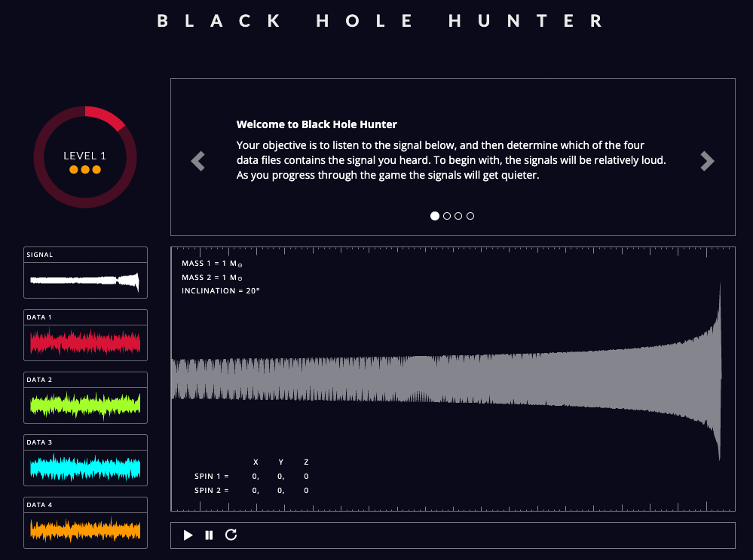
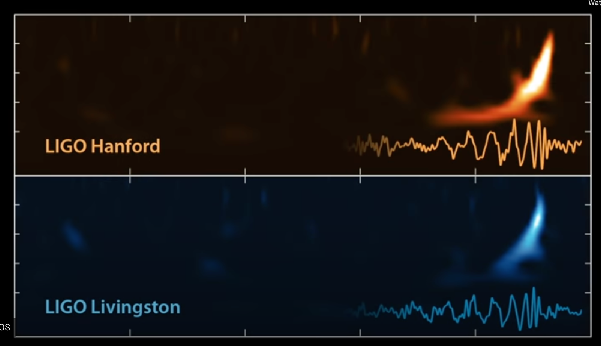
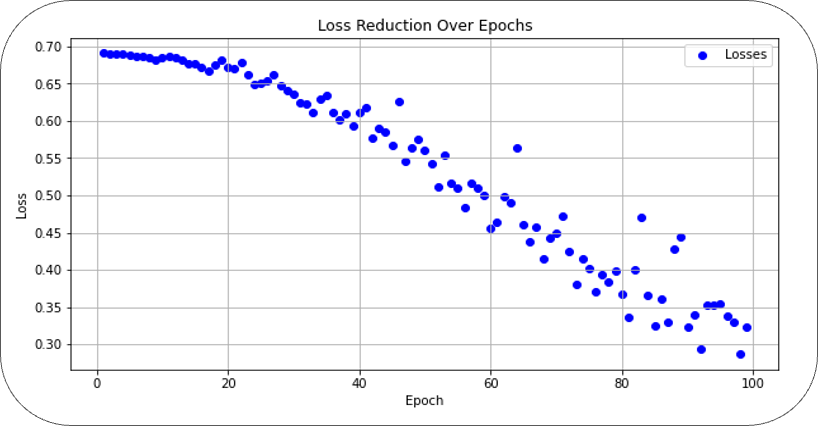

# Audio Transformers for LIGO Gravity Wave Classification.
## Introduction:

The Laser Interferometer Gravitational-Wave Observatory (LIGO) is a revolutionary astrophysical observatory designed specifically to detect gravitational waves. These waves are ripples in spacetime caused by violent cosmic events such as the merger of black holes or neutron stars. LIGO's detections provide a novel way to study the universe, complementary to traditional electromagnetic observatories.

## How LIGO Works:

LIGO (Laser Interferometer Gravitational-Wave Observatory) detects GWs using the interference of laser beams traveling along its long arms. When GWs pass by Earth, they stretch and squeeze spacetime, differentially changing the lengths of LIGO's arms and thus the laser beam interference pattern at the time of beam recombination.

LIGO's detections provide a new spectrum to astronomy, much like radio and x-rays, opening up a new window into the observing the universe.

  

## Lets explore LIGO data

Determining whether or not a gravity wave signal exists within a clip of signal from the LIGO detector is not a trivial at all. The gravity wave signal is typically very short, and much smaller in magnitude than noise. In fact, it’s so much smaller that the problem is practically impossible for humans!

#### Lets play a game to understand LIGO data more.

  

#### Data Exploration:

- There are not more events happened till now. But we can create as much data we want to create by adding noise to signal.

Data Card: https://github.com/losc-tutorial/quickview. Here is one of reference we used for LIGO data collection. It includes data sourcing information and data analysis information. Please explore it understand the quality of data.  

##### Cosmic Sound?

The interference pattern from LIGO is a frequency-time signal, similar to audio data. So, we can make use of AI/ML tools developed for audio to understand this data.

  

##### Un-Cosmic Noise:

Although these gravity waves come from colliding massive objects, the signal is very small.

This small signal gets buried deeply in the noise of the detector, along with other non-cosmic signals, like that of earthquakes, cars driving by, glitches in the detector, etc.

  

## Why Transformers Work here?

Deep Learning based classification models are famous in current stage. In particular, models trained based on CNN-based deep neural networks. These are often trained using both simulated and real gravitational waves. Most existing LIGO pipelines still rely on tried and true signal processing techniques combined with some CNN-based deep learning like PyCBC (matched filtering to identify signals in LIGO data), Coherent WaveBurst (signal reconstruction using wavelet transformations), Deep Filtering (deep CNNs to classify noise vs gravitational wave signals).

The success of deep learning models in LIGO can be attributed to their ability to utilize raw waveform data, employ robust architectures like CNNs and transformers, leverage simulation data for pretraining, denoise to reveal weak signals, and integrate multimodal strategies combining AI with signal processing. With more data and improved models, accuracy continues to increase.

Some key advantages of transformers for this application:
- Robustness to noisy data.
- Prior CNN-based models for GW detection struggled to capture long-range dependencies in the sequential waveform data. Attention mechanisms in transformers are well-suited for modeling these long-range relationships. The transformer encoder consisting of multiple self-attention layers. Allows relating signals across the entire timestep sequence.
- Self-attention draws global relationships between all points in the sequence. This is useful for determining phase shifts and time-of-arrival differences critical for GW detection. Multi-head attention can learn diverse patterns.

Overall, transformers show promise for gravitational wave detection due to their ability to model complex dependencies in sequential data.We leverage the power of audio transformers’ deep understanding of audio data to solve our classification problem: does a gravity wave signal exist, or not, in a signal segment?
- Whipher
- Wav2vec2

## Whipher:

##### What is Whisper?

ASR System: Whisper is an Automatic Speech Recognition system, designed to transcribe spoken language into text.
Training of Whisper
Extensive Training Data: Whisper was trained on a massive 680,000 hours of multilingual and multitask supervised data.
Model Architecture
    Encoder-Decoder Transformer: Utilizes a simple, yet effective, end-to-end architecture known for its efficiency in handling sequential data.
Application to Time Series Data like Gravitational Waves
    Adaptable to Various Data Types: The model's robustness and flexibility make it suitable for analyzing complex datasets, including non-audio time series data.

##### Whipsher Sudo Code:

        Algorithm WhisperForwardPass(x):

        /* Whisper forward pass */  

        Input: x, sequence of token IDs
        Output: P, sequence conditional distributions

        Hyperparameters: max_len, L, H, de, dm, df  

        Parameters θ:
            We, Wp - token and positional embeddings  
            For l in (L):  
                Wl - multihead self-attention weights  
                γ1l, β1l, γ2l, β2l - layer norm parameters  
                Wlmlp1, blmlp1, Wlmlp2, blmlp2 - MLP parameters  
            Wf, bf, γ, β - final projection and layer norm
            Wu - unembedding matrix

        steps:
            1. Get token embeddings et = We[:,x[t]] + Wp[:,t]  
            2. X = stack(e1,...,e_maxlen)
            3. For l = 1..L:
                4. LayerNorm(X)  
                5. Attend(X, Wl)
                6. LayerNorm(X)
                7. MLP(X)
            8. LayerNorm(X)
            9. Unembed(X) to get P

        return P

##### Why need encoder-decoder:
        So our initial goal is to achieve classification problem.
        So do we need to why did we consider sequence to sequence model.
        Simple encoder with classification head should be enough.
        What we have is sequence to sequence model.
        Do we need to complicate the model?

We can make use of the encoders of these models, which generate lower-dimensional,highly informatic representations of the audio signal. We can attach a classification head on top of it. Simple solution.

##### Model Development:

Main Idea: As the model is already trained on audio to text data, it might be able to perform well on LIGO waves detection with finetuning. Based on performance, we can go for full traning of the transformer utulzing the whipsher learning based on transfer learning concept.

  

##### Whisher Fine Tuning Results:

Whisper Audio model fine-tuning shows promising results. In the initial runs, the model's loss did not decrease, but class balance (average F1 scores) has improved. Eventually, the model's losses reduced overall.
Test Accuracy: 81%

Next Steps: Further fine-tune the model, perhaps with mock data pretraining and advanced hyperparameter tuning. Based on the results, retrain the complete architecture.

  
  

###### Wav2Vec:
Wav2Vec2 is a self-supervised learning model that excels in speech recognition and audio processing. Key features include:

  1. Training Methodology: It's trained unsupervised on large volumes of unlabeled audio, learning the audio's structure. Fine-tuning on labeled data then sharpens its task-specific capabilities.

  2. Advantages: The model offers high accuracy in audio recognition, efficient learning with less reliance on labeled data, and robustness in varied audio qualities and noisy environments.

  3. Application in LIGO Gravitational Wave Data: Wav2Vec2 can identify complex patterns in gravitational wave data, filter out background noise, and apply transfer learning using a smaller set of labeled gravitational signals.

###### Sudo Code:

        Algorithm Wav2Vec2ForwardPass(x):

        /* Wav2vec 2.0 forward pass */

        Input: x, raw waveform
        Output: P, token distributions  

        Hyperparameters: L, H, df, dm, dv  

        Parameters θ:
            f - feature encoder layers
            Wq, Wk, Wv, Wo - multihead attention weights
            γ1, β1, γ2, β2 - layer norm parameters
            Wmlp1, blmlp1, Wmlp2, blmlp2 - MLP parameters
            Wf, bf, γ, β - final projection layer norm
            Wu - unembedding matrix

        Steps:
            1. z = f(x) # latent speech representations
            2. q = gumbel_quantize(z) # quantized targets
            3. Z = LayerNorm(z)  
            4. for l = 1..L:  
                5.   Attend(Z, Wl)
                6.   LayerNorm(Z)
                7.   MLP(Z)
            8. LayerNorm(Z)  
            9. Unembed(Z) to get P

        return P

###### Results

Our latest LIGO training on the DGX system has produced some promising results:
Steadily decrease in training loss as epochs iterate
       -   Test Accuracy: 74%
       -   These results shows signs of effective learning from the model

Next Step: Further fine-tune the model tailored to LIGO dataset

  
  

## Code Demonstration
https://colab.research.google.com/drive/15LSdLoFGJaPlMloXIbw7SCKnwmI6K9xS?authuser=1#scrollTo=ggtNAe8e88bK

##### Code demo: https://colab.research.google.com/drive/15LSdLoFGJaPlMloXIbw7SCKnwmI6K9xS?authuser=1#scrollTo=2v5EHi_K88bK

## Critical Analysis:

###### Key Takeaways:
Our work shows signs of effective learning from the model.

###### Limitations:

LIGO models should be trained on simulated data and tested on real data. As the noise in the LIGO data changes everytime LIGO go for more sensitive detectors. Training on real data can overfit the model for that particular noise.

Wav2Vec model is only trained on 1k records.

## Future Work:

WHISPER and wav2vec2 able to learn with some of the features in the gravity wave data from fine tuning. Considering the difficulty of transferring a human speech task to gravity wave task (they’re really not the same thing!), the results are great.

This is great for our next steps, as it shows that audio model architectures that have been utilized for human speech are promising choices for other audio-like applications.

##### what’s next?

Continue training these models to get the best-possible fine-tuned results. The results shown here are still relatively preliminary, advanced deep learning optimization techniques, new and large training data collection methods(Simulated data) can boost the tuning performance.

Can continue with fine tuning (retraining) complete model instead of freezing few layes to boost the performance.

Build a foundational model for LIGO data. A foundational model on LIGO data could be applied to a variety of downstream tasks, including classification, for maximum performance.

## Repo:

https://github.com/vanderbilt-data-science/LIGO

## Video Recordings:

https://github.com/DivyaMereddy007/LIGO_Personal_Folder/blob/main/Project_Demo.mp4

## Resources Links:

[1]	https://gwosc.org/tutorials/

[2] https://www.youtube.com/watch?v=B4XzLDM3Py8

[3] https://gwosc.org/workshops/

[4] https://cdn.openai.com/papers/whisper.pdf

[5] https://huggingface.co/learn/audio-course/chapter0/introduction

[6] https://github.com/vanderbilt-data-science/ai_summer

[7] https://arxiv.org/abs/2006.11477

[8] Jiang, L.; Luo, Y. Convolutional Transformer for Fast and Accurate Gravitational Wave Detection. In Proceedings of the 2022 26th International Conference on Pattern Recognition (ICPR), Montreal, QC, Canada, 21–25 August 2022; pp. 46–53. [Google Scholar] [CrossRef]

[9] Interpretable AI forecasting for numerical relativity waveforms of quasi-circular, spinning, non-precessing binary black hole mergers, https://arxiv.org/pdf/2110.06968.pdf (No CNN)

[10]Space-based gravitational wave signal detection and extraction with deep neural network, https://www.nature.com/articles/s42005-023-01334-6

[11]https://cdn.openai.com/papers/whisper.pdf

## Citations:
Main Contributors: DSI Vanderbilt Univeristy, Dr. Karan Jani (PI)*, Dr. Chayan Chatterjee (PI)*, Dr. Abbie Petulante (DSI Lead), Albert Hu, Divya Mereddy, Dr. Brandon Soubasis, Stephen Zhao   
